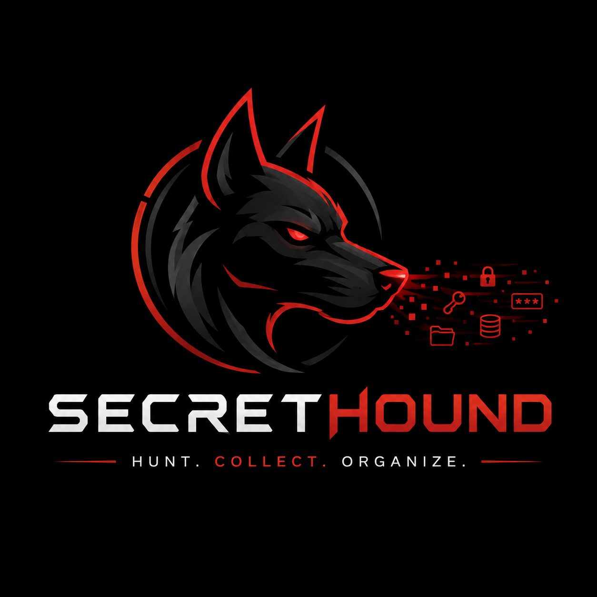

<p align="center">
  
</p>

<p align="center">
  <b>Hunt · Collect · Organize</b><br>
  Offline credential &amp; secret analyzer for OSCP+ loot.
</p>

<p align="center">
  <a href="#"></a>
  <a href="#"></a>
  <a href="#"></a>
  <a href="#"></a>
</p>

---

```
  ═════════════════════════════════════════════════════════════════════
      / \__
     (    @\___
     /         O
    /   (_____/
   /_____/

    ____                    _           _   _                        _
   / ___|  ___  ___ _ __ __| |_        | | | | ___  _   _ _ __   __| |
   \___ \ / _ \/ __| '_/ _ \  _|       | |_| |/ _ \| | | | '_ \ / _` |
    ___) |  __/ (__| | |  __/ |_       |  _  | (_) | |_| | | | | (_| |
   |____/ \___|\___|_|  \___|\__|      |_| |_|\___/ \__,_|_| |_|\__,_|
  ─────────────────────────────────────────────────────────────────────
             H U N T  ●  C O L L E C T  ●  O R G A N I Z E
  v2.0                                       Red Team Loot Intelligence
  ═════════════════════════════════════════════════════════════════════
```

<sub>*Rendered live in color when run in an interactive terminal — SECRET half
bold white, HOUND half bright red, hound's eye `@` and nose `O` red, tagline
bullets `●` red, `v2.0` red, dividers dim red. Colors auto-disable when stdout
is piped or `--no-color` is passed; the box-drawing glyphs auto-downgrade to
7-bit ASCII (`=` / `-` / `*`) under `--ascii`.*</sub>

## What it is

**SecretHound** is a pure-Python, zero-dependency, **offline** analyzer that
reads loot you already hold and points you at the credentials, hashes,
tokens, key material, and attack-landed markers hiding inside.

The tool **points**; you **act**. It never touches a target — no scanning,
no exploitation, no network calls — so it stays on the right side of the
OSCP+ exam rules.

## What it isn't

- **Not** a scanner. It doesn't probe hosts, resolve DNS, or open a socket.
- **Not** an exploit framework. It surfaces evidence; you drive the attack.
- **Not** a wrapper around Metasploit, Responder, ntlmrelayx, sqlmap,
  hydra/medusa/ncrack, or any other online / mass tool. All of those are
  explicitly excluded from suggested next-steps to preserve exam legality.

## Quick start

```bash
# Point it at your whole engagement directory (loot + scans + notes)
python3 secrethound.py ./engagement --deep --json findings.json --hashes crack.txt

# Read a single file in depth (every secret-bearing line, numbered)
python3 secrethound.py --inspect suspicious_config.txt

# Emit a self-contained HTML report + CSV of cred pairs for the appendix
python3 secrethound.py ./engagement --html report.html --csv creds.csv

# Scripted / CI-friendly (no banner, no colors, JSON only)
python3 secrethound.py ./engagement --quiet --json findings.json --no-color

# Legacy terminal (7-bit ASCII glyphs only, no box-drawing chars)
python3 secrethound.py ./engagement --ascii
```

Read the **ATTACK PATH** panel first — the ranked *BEST NEXT ACTION* is
your move.

### Output flags cheat-sheet

| Flag              | Effect                                                                 |
|-------------------|------------------------------------------------------------------------|
| `--deep`          | Run entropy analyzer + all detectors (more coverage, more noise)       |
| `--json FILE`     | Write findings + attack-chains as JSON. Auto-suppresses startup banner |
| `--html FILE`     | Self-contained HTML report (KPI + scoreboard + chains + tables)        |
| `--csv FILE`      | CRED PAIRS + hashes + secrets as CSV for the report appendix           |
| `--hashes FILE`   | Crack-ready hashes file + printed `hashcat -m <mode>` commands         |
| `--quiet`         | Suppress banner + progress on stderr (stdout still shows dashboard)    |
| `--no-color`      | Plain output — for piping, `script(1)` logging, or dumb terminals      |
| `--ascii`         | Degrade box-drawing / bullet glyphs to 7-bit ASCII (`= - *`)           |
| `--inspect FILE`  | Deep-dive one file: every secret-bearing line, numbered                |

## Features

- **300+ tuned detectors** across the modern AD / Kerberos / ADCS / DPAPI
  attack surface — mimikatz, secretsdump, Rubeus (asktgt / s4u), Certipy,
  PowerView, BloodHound, SharpDPAPI, SharpChrome, NetExec (Pwn3d!),
  BloodyAD, kerbrute, msfvenom, and dozens more.
- **Pivot / tunnel landing** — chisel, ligolo-ng, ssh -L/-R/-D, netsh
  portproxy, socat forwarders.
- **Config-loot extractors** — Postfix, OpenLDAP, Dovecot, FreeRADIUS,
  Redis, MongoDB, Elasticsearch, Jenkins, Tomcat, IIS, GPO.
- **Correlation engine** — chains findings into a ranked attack path
  (BloodHound + certipy JSON + potfile + nmap + enum4linux-ng ingestion).
- **Loot-typed parsers** — .kdbx, .pfx, .kirbi, .ccache, lsass dmp,
  ESEDB, PCAP.
- **OSCP+ compliance** guardrails — every suggested command is vetted
  against `analyzers/compliance.py`; lab-only techniques (Responder /
  relay) are surfaced but excluded from the ranked path.
- **Output**: colorized terminal, JSON, self-contained HTML, CSV appendix,
  hashcat-ready cracking pack.

## Severity

| Tag | Level | Meaning |
|-----|-------|---------|
| `[!!]` | CRITICAL | decoded credential, user+pass pair, default-pw hash — act now |
| `[!]`  | HIGH     | real secret value, crackable hash, private key, key file |
| `[~]`  | MEDIUM   | probable hash/token to verify / backup / history |
| `[-]`  | LOW      | weak high-entropy lead — verify by hand |
| `[+]`  | INFO     | interesting file located — read it |

## OSCP+ compliance

SecretHound is designed for the OSCP+ exam workflow. It:

- Reads only local files (your loot, other tools' output, your notes, your
  `~/.hashcat` / `~/.john` potfiles, `/etc/hosts`, `~/.ssh`).
- Never opens a network connection or resolves a hostname.
- Suggests only exam-legal follow-up techniques (manual, targeted).
- Tracks Metasploit / msfvenom invocations against the exam's one-target
  quota and flags repeated usage as HIGH.
- Marks `[LAB-ONLY]` techniques that rely on spoofing (Responder / relay /
  mitm6) and excludes them from the ranked ATTACK PATH.

## Repository layout

```
.
├── secrethound.py       # CLI entry point
├── analyzers/           # per-file detectors + ingest adapters
│   ├── keyword.py       # main multi-line detector engine
│   ├── credpairs.py     # user:pass classifier
│   ├── patterns.py      # hash + token patterns
│   ├── filters.py       # doc-file / placeholder / noise gates
│   ├── compliance.py    # OSCP+ exam-rule enforcer
│   └── ingest/          # nmap / BloodHound / nxc.db / secretsdump / …
├── core/                # correlator + report renderer + HTML + UI
└── docs/                # SecretHound.png logo + reference assets
```

## Requirements

- Python 3.8+
- Optional: `cryptography` (only for encrypted-PEM decryption; the tool
  runs fine without it).

## License

MIT.
